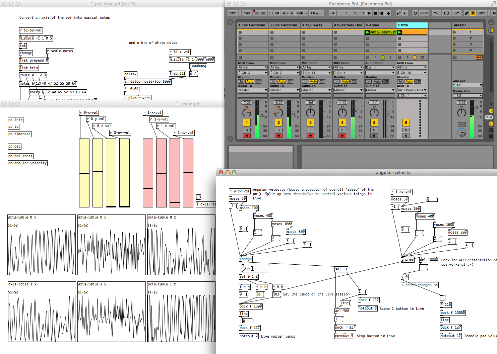

Raspberry Poi - Pure Data and Ableton Live
========
Pd patches and Ableton Live set as used in London Music Hack Day 2014.



##### Running the patch
The patch runs in [Pd-vanilla](http://puredata.info/downloads/pure-data), and any required externals are included.  
1.  Open ```_main.pd``` in the root directory  
2.  Set the MIDI output device of Pd to be the virtual MIDI bus (Here's a [guide on how to set up virtual MIDI on a Mac](https://www.ableton.com/en/articles/using-virtual-MIDI-buses-live/)) so we can send MIDI messages from Pd to Live  
3.  Open the Live set  
4.  Play some real or pre-recorded data through the patch and make music!