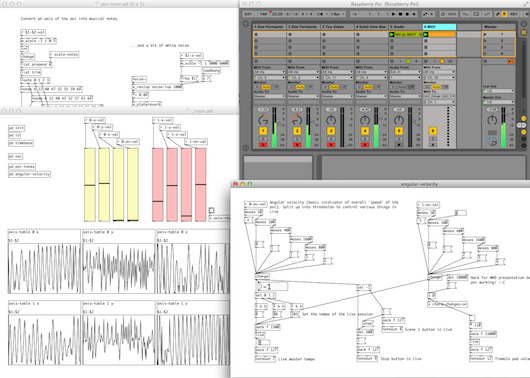

Raspberry Poi - Pure Data and Ableton Live
========
Pd patches and Ableton Live set as used in London Music Hack Day 2014.



##### Running the patch
The patch runs in [Pd-vanilla](http://puredata.info/downloads/pure-data), and any required externals are included.  
1.  Open ```_main.pd``` in the root directory  
2.  Set the MIDI output device of Pd to be the virtual MIDI bus ([Here's](https://www.ableton.com/en/articles/using-virtual-MIDI-buses-live/) a guide on how to set up virtual MIDI on a Mac) so we can send MIDI messages from Pd to Live  
3.  Play some live or preset data through the patch and make music!